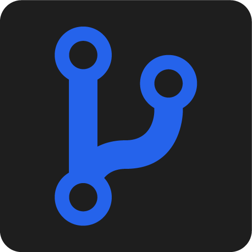
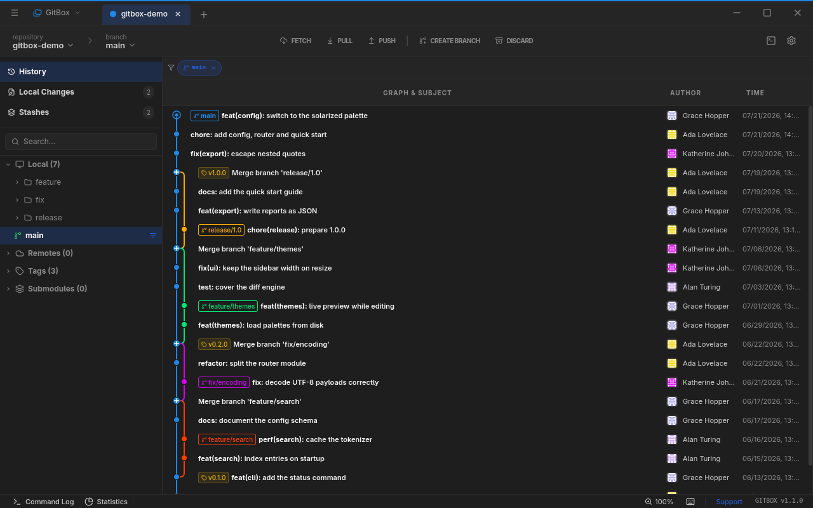

<h1 align="center">
  
  &nbsp;GitBox
</h1>

<p align="center">
  A fast, self-contained Git GUI built with Vue 3, Electron and a C++ addon over libgit2.<br />
  No <code>git</code> binary required — clone, fetch, pull and push run natively over HTTPS and SSH.
</p>

<p align="center">
  <a href="https://github.com/gitgusilva/gitbox/releases/latest"></a>
  <a href="https://github.com/gitgusilva/gitbox/releases"></a>
  <a href="https://github.com/gitgusilva/gitbox/stargazers"></a>
  <a href="LICENSE"></a>
</p>

<p align="center">
  
</p>

## Features

- **Visual history** — commit graph with a virtualized list, multi-branch filtering, and Monaco-powered diffs
- **Tabbed workspaces** — several repositories at once, grouped into colour-coded projects
- **Integrated terminal** — real shell sessions (xterm.js + node-pty) in the bottom panel
- **Merge conflicts** — side-by-side resolution in its own window
- **Remotes** — per-host credentials in an encrypted store, plus pull requests and repository statistics
- **Themeable** — design-token themes with an in-app editor and a community theme registry
- **Localized** — English, Brazilian Portuguese and Spanish

## Install

Download the latest build from [Releases](https://github.com/gitgusilva/gitbox/releases/latest):

| Platform | Formats |
| --- | --- |
| Linux | `.AppImage`, `.deb`, `.rpm`, `.pacman` |
| Windows | `.exe` (NSIS), `.msi` |

The AppImage and the Windows installer update themselves from GitHub Releases;
`.deb`, `.rpm` and `.pacman` are updated by your package manager. GitBox bundles
libgit2 and its TLS stack, so there is nothing else to install — a local Git is
not required.

The Linux packages are built on Ubuntu 22.04, so they need glibc 2.35 or newer
(Ubuntu 22.04+, Debian 12+, Fedora 36+, RHEL 9+). SSH remotes (`git@…`) work on
Linux; the Windows build authenticates over HTTPS for now.

## Building from source

Requires Node.js 20+, npm, a C++ toolchain (gcc/clang or MSVC), CMake, Ninja and Perl.

```bash
# 1. Static libgit2 + mbedTLS + libssh2 + OpenSSL (~20 min, cached afterwards).
#    On Windows: core/addon/vendor/build-libgit2.ps1
./core/addon/vendor/build-libgit2.sh

# 2. CA bundle for native HTTPS (mbedTLS has no system trust store).
mkdir -p core/addon/certs
curl -fsSL https://curl.se/ca/cacert.pem -o core/addon/certs/cacert.pem

# 3. Native addon.
npm --prefix core/addon install && npm --prefix core/addon run build

# 4. UI + app. `dev` starts Vite and Electron together.
npm --prefix app/ui install
npm --prefix ui/electron install && npm --prefix ui/electron run dev
```

Packaging targets live in `ui/electron/package.json`; the release pipeline is in
[.github/workflows](.github/workflows).

## Contributing

Read [CONTRIBUTING.md](CONTRIBUTING.md) for the workflow and coding standards.
Third-party dependencies and their licenses are listed in
[THIRD_PARTY_LICENSES.md](THIRD_PARTY_LICENSES.md).

## License

GitBox - Copyright (C) 2026 GitBox Team

This program is free software: you can redistribute it and/or modify it under
the terms of the GNU Lesser General Public License as published by the Free
Software Foundation, either version 3 of the License, or (at your option) any
later version. It is distributed in the hope that it will be useful, but
WITHOUT ANY WARRANTY, without even the implied warranty of MERCHANTABILITY or
FITNESS FOR A PARTICULAR PURPOSE.

The LGPL text is in [LICENSE](LICENSE); it adds permissions on top of the GNU
General Public License, whose text is in [GPL-3.0.txt](GPL-3.0.txt). Read both
together.

Releases up to and including v1.2.0 were published under the MIT License and
remain available under it.
